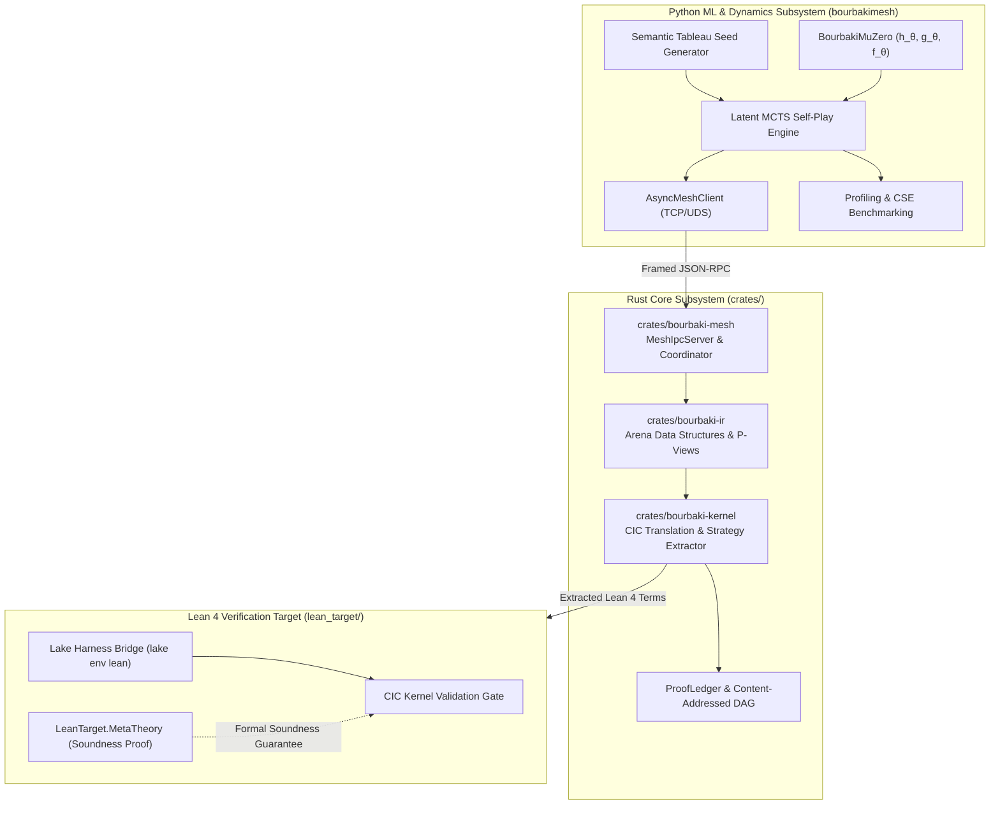

# BourbakiMesh: Game-Semantic Dialogue Proving & Distributed Proof Ledger

BourbakiMesh is a high-performance, polyglot automated theorem proving and formal deduction ecosystem. It unifies **game-semantic dialogue categories (Hyland-Ong / Lorenzen arenas)**, **Calculus of Inductive Constructions (CIC) proof-term extraction**, **PyTorch Latent Monte Carlo Tree Search (MCTS) self-play dynamics**, and a **cryptographic peer-to-peer proof DAG ledger** targeting Lean 4.

---

## 🏛️ System Architecture



---

## 📦 Monorepo Subsystems

| Subsystem Path | Toolchain | Core Responsibility |
| :--- | :--- | :--- |
| **`crates/bourbaki-ir`** | Rust 1.80+ (2021/2024 ed.) | Dialogue arena AST, Hyland-Ong / Lorenzen play traces, polarities ($P$ vs $O$), P-view/O-view calculation, and well-bracketing stack discipline. |
| **`crates/bourbaki-kernel`** | Rust 1.80+ (2021/2024 ed.) | Minimal Calculus of Inductive Constructions (CIC) AST, Lean 4 term emitter, 5-rule strategy extraction compiler $\mathcal{E}(\sigma)$, and term decompiler. |
| **`crates/bourbaki-mesh`** | Rust 1.80+ (2021/2024 ed.) | Content-addressed cryptographic proof DAG (`ProofBlock`, `BlockId`), `ProofLedger`, Tokio async IPC server (TCP/UDS), and coordinator RPC. |
| **`src/bourbakimesh`** | Python 3.11+ (Torch, PyTest) | `BourbakiMuZero` neural dynamics ($h_\theta, g_\theta, f_\theta$), polarity-inverting Latent MCTS, semantic tableau cold-start generator, and `AsyncMeshClient`. |
| **`lean_target/`** | Lean 4 (`lake`, v4.33.0) | Zero-trust Lean 4 kernel verification harness and mechanized meta-theoretic soundness formalization (`LeanTarget.MetaTheory`). |

---

## 🚀 Quickstart & Verification

### Prerequisites
- **Rust Toolchain:** 1.80+ (`rustup component add clippy rustfmt`)
- **Python Environment:** 3.11+ (`torch`, `pydantic`, `pytest`)
- **Lean 4:** [`elan`](https://github.com/leanprover/elan) with `leanprover/lean4:v4.33.0`

### 1. Python Environment Setup
```bash
python3 -m venv .venv
source .venv/bin/activate
pip install -e ".[dev]"

# Run full Python test suite (16 tests)
pytest tests/
```

### 2. Rust Workspace Build & Tests
```bash
# Lint checks (zero warnings policy)
cargo fmt --check
cargo check --workspace
cargo clippy --workspace -- -D warnings

# Run all Rust unit, integration, and Tier 3a proptests (42 tests)
cargo test --workspace

# Run Criterion micro-benchmarks
cargo bench --workspace -- --test
```

### 3. Lean 4 Verification Harness
```bash
cd lean_target
lake build
cd ..
```

### 4. Performance & CSE Benchmark Run
```bash
# Run quick benchmark profile
.venv/bin/python -m bourbakimesh.benchmarks.cli --quick
```

---

## 🛡️ 3-Tiered Soundness Architecture

BourbakiMesh eliminates unsound proofs through three orthogonal defense tiers:
1. **Tier 1 (Operational Runtime Gate):** Every extracted proof term is submitted to `lake env lean` to pass the official Lean 4 type-checker without `sorry` or unverified axioms.
2. **Tier 2 (Mechanized Meta-Theory):** Formalization of arena dialogue syntax, P-views, deep CIC embeddings, and the Master Soundness Theorem in Lean 4 (`LeanTarget.MetaTheory`).
3. **Tier 3 (Empirical Testing):**
   - **Tier 3a:** Generative property-based fuzzing (`proptest`) verifying alternation, pointer acyclicity, and stack discipline.
   - **Tier 3b:** Adversarial falsification hunt targeting $\bot$ (False) and round-trip isomorphism ($\text{CIC} \to \text{StrategyTree} \to \text{CIC} \to \text{Lean 4 Kernel}$).

---

## 🤝 Contributing & Community

We welcome contributions across formal logic, category theory, neural dynamics, and distributed systems!

- **[Contributing Guidelines](CONTRIBUTING.md):** Detailed environment setup, commit conventions, and pull request checklist.
- **[Request for Comments (RFCs)](rfcs/):** Review active proposals and use [`rfcs/0000-template.md`](rfcs/0000-template.md) for major architectural changes.
- **[GitHub Discussions](https://github.com/tryggth/bourbakimesh/discussions):** Join discussions on theoretical foundations and system architecture.
- **[GitHub Wiki](https://github.com/tryggth/bourbakimesh/wiki):** Comprehensive technical specifications, API guides, and theoretical papers.

---

## 📜 License

Licensed under either of [Apache License, Version 2.0](LICENSE-APACHE) or [MIT License](LICENSE-MIT) at your option.
