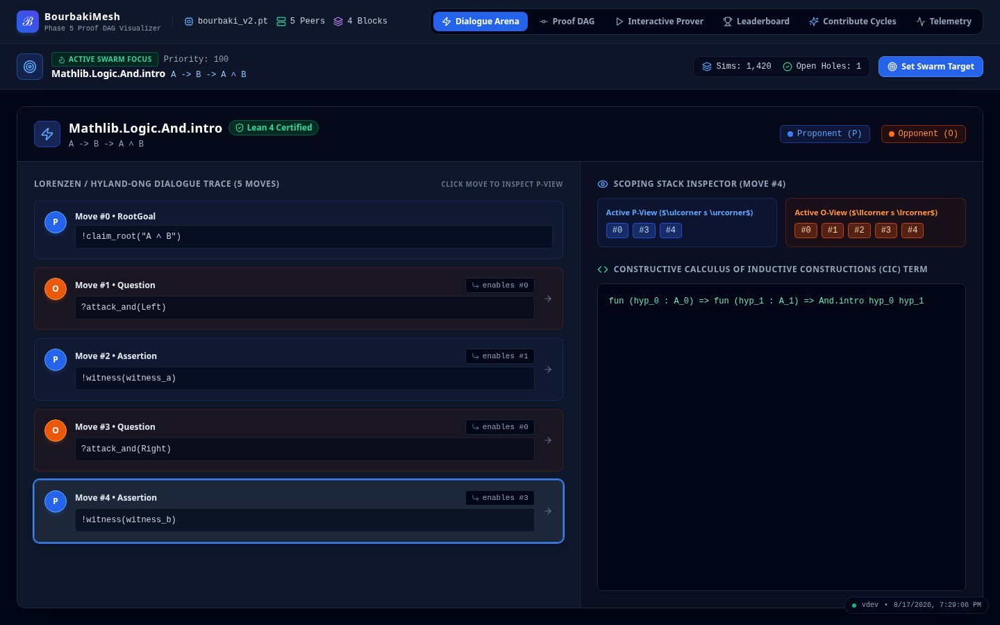
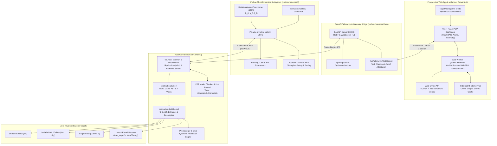

# BourbakiMesh: Game-Semantic Dialogue Proving & Distributed Proof Ledger

[](https://github.com/tryggth/bourbakimesh/actions)
[](https://www.rust-lang.org)
[](https://www.python.org)
[-brightgreen.svg)](STATUS_REPORT.md)
[](ui/)
[](#-license)

BourbakiMesh is a high-performance, polyglot automated theorem proving and formal deduction ecosystem. It unifies **game-semantic dialogue categories (Hyland-Ong / Lorenzen arenas)**, **Calculus of Inductive Constructions (CIC) proof-term extraction**, **PyTorch Latent Monte Carlo Tree Search (MCTS) self-play dynamics**, a **libp2p peer-to-peer proof DAG ledger**, an **auto-updating WebGPU Progressive Web App (PWA)**, and a **zero-trust verification bridge targeting Lean 4, Coq, Isabelle/HOL, and Dedukti**.

<p align="center">
  <a href="https://tryggth.github.io/bourbakimesh/">
    
  </a>
  <br/>
  <em>Interactive Progressive Web App & Volunteer Prover Dashboard (<a href="https://tryggth.github.io/bourbakimesh/">tryggth.github.io/bourbakimesh</a>)</em>
</p>

---

## 🏛️ System Architecture



---

## 📦 Monorepo Subsystems

| Subsystem Path | Toolchain | Core Responsibility |
| :--- | :--- | :--- |
| **`crates/bourbaki-ir`** | Rust 1.80+ (2021/2024 ed.) | Dialogue arena AST, Hyland-Ong / Lorenzen play traces, polarities ($P$ vs $O$), P-view/O-view calculation, arena cuts, and well-bracketing stack discipline. |
| **`crates/bourbaki-kernel`** | Rust 1.80+ (2021/2024 ed.) | Minimal Calculus of Inductive Constructions (CIC) AST, 5-rule strategy extraction compiler $\mathcal{E}(\sigma)$, batch corpus decompiler (`decompile_corpus`), and universal multi-target emitters (**Lean 4, Coq, Isabelle/HOL, Dedukti**). |
| **`crates/bourbaki-mesh`** | Rust 1.80+ (2021/2024 ed.) | Content-addressed cryptographic proof DAG (`ProofBlock`, `BlockId`), `ProofLedger`, Byzantine attestation engine, standalone `bourbaki-daemon` binary, libp2p GossipSub & Kademlia DHT swarm, and P2P model weight chunking & hot-reloading. |
| **`src/bourbakimesh`** | Python 3.11+ (Torch, FastAPI) | 25M-parameter `RelationalArenaTransformer`, `BourbakiMuZero` neural dynamics ($h_\theta, g_\theta, f_\theta$), polarity-inverting Latent MCTS, Prioritized Experience Replay (PER), champion tournament gating, and FastAPI telemetry server. |
| **`ui/` (PWA Dashboard)** | Vite + React + TypeScript + Tailwind | Auto-updating Progressive Web App, real-time proof DAG visualizer, interactive dialogue tree view, **"Contribute Cycles" volunteer WebGPU prover**, and top-level target theorem injection manager. |
| **`lean_target/`** | Lean 4 (`lake`, v4.33.0) | Zero-trust Lean 4 kernel verification harness, mechanized meta-theoretic soundness formalization (`LeanTarget.MetaTheory`), and Mathlib export tool (`export_mathlib`). |

---

## 🌐 Interactive Web UI & In-Browser Volunteer Solver

BourbakiMesh features a complete Progressive Web App located in `ui/` that connects directly to the distributed proving mesh.

```bash
# Launch both FastAPI backend and Vite frontend simultaneously:
./scripts/launch_live_ui_demo.sh

# Or run frontend independently:
cd ui && npm install && npm run dev
# Accessible at http://localhost:5173
```

### Key UI Features

1. **"Contribute Cycles" Volunteer Engine ([`ui/src/components/VolunteerPanel.tsx`](file:///home/tryggth2009/bourbakimesh/ui/src/components/VolunteerPanel.tsx)):**
   - **In-Browser Proving:** Runs MCTS tree search directly in a dedicated Web Worker using ONNX Runtime WebGPU and WebAssembly SIMD (`prover.worker.ts`).
   - **Web Crypto Identity:** Generates an ephemeral ECDSA P-256 keypair in browser memory and derives a deterministic cryptographic `peer_id` (`cryptoIdentity.ts`).
   - **Power Profiles:** Switch between *Eco* ($25\text{ sims/move}$), *Balanced* ($100\text{ sims/move}$), and *Max* ($250\text{ sims/move}$).
   - **Thermal & Battery Protection:** Hooks into `navigator.getBattery?.()` and `document.visibilityState` to auto-pause when unmetered power drops below 20% or tab is backgrounded.
   - **Signed Proof Submission:** Extracts winning strategies $\mathcal{E}(\sigma)$, signs the payload with Web Crypto, and submits it to the mesh gateway for Lean 4 verification and DAG commitment.

2. **Top-Level Swarm Target Injection ([`ui/src/components/TargetManager.tsx`](file:///home/tryggth2009/bourbakimesh/ui/src/components/TargetManager.tsx)):**
   - Allows users and operators to specify active top-level target theorems (e.g., from Mathlib or custom propositions) with priority weighting.
   - Immediately broadcasts a `swarm_target_set` directive across the WebSocket mesh to focus all daemon and volunteer worker rollouts.

3. **Auto-Updating PWA & Offline DAG Caching:**
   - Configured with `vite-plugin-pwa` and Workbox for automatic background updates and Service Worker cache busting.
   - Hydrates proof DAG state from local IndexedDB (`idb-keyval`) when offline.

---

## 🚀 Quickstart & Verification Matrix

### 1. Verification Suite (140 tests)

```bash
# 1. Rust Workspace Check & Unit/Integration Tests (71 passed)
cargo check --workspace
cargo test --workspace

# 2. Python Test Suite & Type Verification (69 passed)
.venv/bin/pytest tests/

# 3. PWA Frontend Production Build & Types
cd ui && npm test && npm run build && cd ..

# 4. Lean 4 Kernel Harness (12 jobs passed)
cd lean_target && lake build && cd ..
```

### 2. Standalone Rust Daemon & P2P Swarm

```bash
# Start a standalone Bourbaki daemon with embedded MCTS worker:
cargo run --bin bourbaki-daemon -- --p2p-port 9000 --rpc-port 8080 --model-path checkpoints/bourbaki_v2.pt
```

### 3. Top-Level Theorem Injection CLI

```bash
# Inject an active target theorem via CLI:
.venv/bin/python -m bourbakimesh.api.target_cli \
  --name "Mathlib.Algebra.Group.mul_left_inv" \
  --lean-code "theorem mul_left_inv (a : G) : a⁻¹ * a = 1 := by sorry" \
  --priority 150
```

---

## 🧠 Model Registry & Baseline Tournaments

| Model Checkpoint | Parameters & Architecture | Elo Rating (±95% CI) | Match Record | Search Throughput (CPU) | CSE Score | Status |
| :--- | :--- | :---: | :---: | :---: | :---: | :---: |
| [`checkpoints/bourbaki_v0.pt`](file:///home/tryggth2009/bourbakimesh/checkpoints/bourbaki_v0.pt) | 25M Relational Transformer ($h_\theta, g_\theta, f_\theta$) | **1485.0** (±86.1) | 28-32-0 (46.7%) | 1,490.3 sims/sec (50 sims) | 2.981x | 🟢 Baseline |
| [`checkpoints/bourbaki_v1.pt`](file:///home/tryggth2009/bourbakimesh/checkpoints/bourbaki_v1.pt) | 25M Relational Transformer ($h_\theta, g_\theta, f_\theta$) | **1530.0** (±86.5) | 34-26-0 (56.7%) | 715.0 sims/sec (100 sims) | 1.430x | 🟢 Fine-Tuned Active |
| [`checkpoints/bourbaki_v2.pt`](file:///home/tryggth2009/bourbakimesh/checkpoints/bourbaki_v2.pt) | 25M Relational Transformer ($h_\theta, g_\theta, f_\theta$) | **1485.0** (±86.1) | 28-32-0 (46.7%) | 1,002.2 sims/sec (100 sims) | 1.580x | 🟢 Gated PER Active |

### Automated P2P Model Sync & Hot-Reloading
- **GossipSub Topic:** `/bourbaki/1.0.0/models`
- **Zero-Downtime:** Daemons reassemble Merkle-verified chunks in the background and hot-swap in-memory model sessions without restarting or dropping active searches.

---

## 🛡️ Zero-Trust Verification & Multi-Target Emitters

BourbakiMesh enforces constructive soundness without trusting neural networks or heuristics:
1. **Dialogue Game Alternation:** Opponent ($O$) and Proponent ($P$) moves strictly alternate with valid justification pointers.
2. **Deterministic Extraction:** Winning strategies $\sigma$ are deterministically compiled to CIC terms via $\mathcal{E}(\sigma)$.
3. **Pluggable Multi-Target Verification:**
   - **Lean 4:** Kernel check via `lake env lean` with zero unverified axioms.
   - **Coq:** Emitted Gallina `.v` proof scripts.
   - **Isabelle/HOL:** Emitted Isar `.thy` proof scripts.
   - **Dedukti:** Emitted higher-order rewrite signatures (`.dk`).

---

## 🤝 Contributing & Documentation

- **[Contributing Guidelines](CONTRIBUTING.md):** Quality gates, Conventional Commits, and development setup.
- **[System Status Report](STATUS_REPORT.md):** Complete issue tracking matrix and benchmark records.
- **[Wiki Documentation](docs/wiki/):**
  - [`docs/wiki/Home.md`](docs/wiki/Home.md): System overview and formal verification pipeline.
  - [`docs/wiki/Volunteer-Computing.md`](docs/wiki/Volunteer-Computing.md): Architecture of browser Web Workers, WebGPU, and Web Crypto.
  - [`docs/wiki/Target-Injection-Protocol.md`](docs/wiki/Target-Injection-Protocol.md): Top-level swarm objective injection API and CLI.
  - [`docs/wiki/P2P-Model-Distribution.md`](docs/wiki/P2P-Model-Distribution.md): P2P chunk gossip, Merkle trees, and zero-downtime hot-reloading.
  - [`docs/wiki/Multi-Target-Compilers.md`](docs/wiki/Multi-Target-Compilers.md): Game-semantic strategy extraction to Lean 4, Coq, Isabelle/HOL, and Dedukti.
- **[Request for Comments (RFCs)](rfcs/):** Architectural proposals including [`rfcs/0002-neural-game-semantic-hinting.md`](rfcs/0002-neural-game-semantic-hinting.md) and [`rfcs/0003-webgpu-browser-inference.md`](rfcs/0003-webgpu-browser-inference.md).

---

## 📂 Monorepo Structure

```
bourbakimesh/
├── Cargo.toml                                 # Rust workspace configuration (2021/2024 ed.)
├── pyproject.toml                             # Python package specification & dependencies
├── CONTRIBUTING.md                            # Contributor guidelines & style guide
├── README.md                                  # System overview & quickstart
├── STATUS_REPORT.md                           # Verification & issue tracking matrix
├── .github/
│   ├── workflows/deploy-pwa.yml               # GitHub Actions PWA automated deployment
│   ├── ISSUE_TEMPLATE/                        # Issue & RFC templates
│   └── pull_request_template.md               # PR verification checklist
├── docs/
│   └── wiki/                                  # Comprehensive technical specifications & wiki
│       ├── Home.md                            # Wiki landing page
│       ├── Volunteer-Computing.md             # In-browser WebGPU prover documentation
│       ├── Target-Injection-Protocol.md       # Swarm objective injection specification
│       ├── P2P-Model-Distribution.md          # P2P weight chunking & hot-reloading
│       └── Multi-Target-Compilers.md          # Universal multi-target extraction
├── rfcs/                                      # Architectural Requests for Comments (RFCs)
├── checkpoints/                               # Pre-trained models (bourbaki_v0, v1, v2)
├── data/                                      # Mathlib exports & curriculum corpora
├── crates/
│   ├── bourbaki-ir/                           # Dialogue Arena AST, views & polarities
│   ├── bourbaki-kernel/                       # CIC AST, strategy extraction & emitters
│   └── bourbaki-mesh/                         # Proof DAG, libp2p swarm & bourbaki-daemon
├── src/bourbakimesh/                          # Python ML & Dynamics Engine
│   ├── api/                                   # FastAPI REST/WebSocket telemetry & CLI
│   ├── corpus/                                # Mathlib curriculum ingestion pipeline
│   ├── training/                              # MuZero training, PER & champion gating
│   ├── models.py                              # RelationalArenaTransformer & BourbakiMuZero
│   └── latent_mcts.py                         # Polarity-inverting Latent MCTS search
├── ui/                                        # Vite + React + TypeScript + Tailwind PWA
│   ├── src/components/                        # DAG, Arena, Prover, Volunteer & Target views
│   ├── src/workers/                           # Web Worker (ONNX WebGPU & Wasm SIMD)
│   ├── src/services/                          # Web Crypto identity & WebSocket client
│   └── vite.config.ts                         # PWA & Workbox service worker configuration
├── tests/                                     # End-to-end Python integration tests
└── lean_target/                               # Zero-Trust Lean 4 verification harness
```

---

## 📜 Licenses

BourbakiMesh is dual-licensed under either:
- **[Apache License, Version 2.0](LICENSE-APACHE)** ([`LICENSE-APACHE`](LICENSE-APACHE))
- **[MIT License](LICENSE-MIT)** ([`LICENSE-MIT`](LICENSE-MIT))

See the top-level **[`LICENSE`](LICENSE)** file for details.
