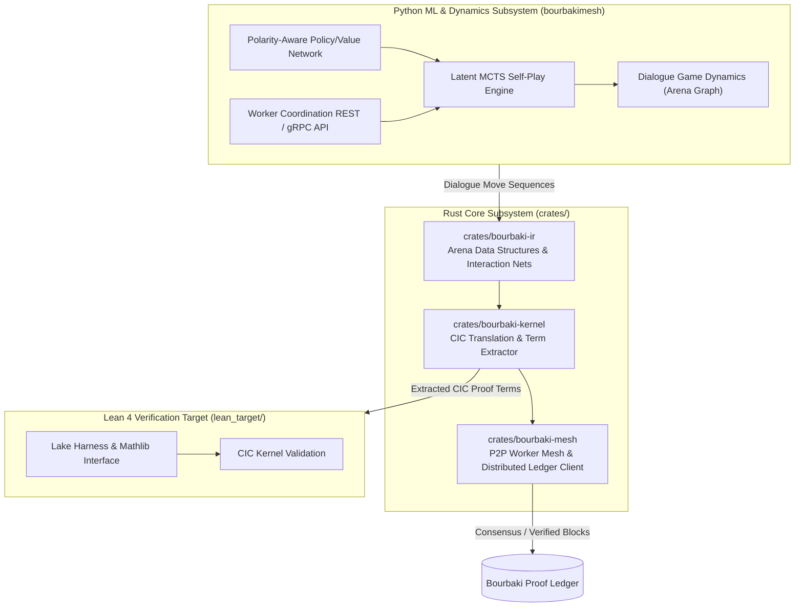

# BourbakiMesh: Game-Semantic Dialogue Proving & Distributed Proof Ledger

BourbakiMesh is a high-performance, polyglot proof generation and verification monorepo. It re-envisions interactive theorem proving and automated deduction by unifying **game-semantic dialogue categories (Hyland-Ong / Lorenzen arenas)**, **Latent Monte Carlo Tree Search (MCTS) self-play dynamics**, and a **distributed peer-to-peer proof ledger** targeting Calculus of Inductive Constructions (CIC) / Lean 4.

---

## 🏛️ System Architecture



---

## 📦 Monorepo Structure

- **`crates/bourbaki-ir`**: Core intermediate representation for game-semantic dialogue arenas, Hyland-Ong / Lorenzen play traces, polarities (Proponent `P` vs Opponent `O`), and interaction nets.
- **`crates/bourbaki-kernel`**: Minimal, foundational CIC (Calculus of Inductive Constructions) translation layer and deterministic proof-term extractor.
- **`crates/bourbaki-mesh`**: Distributed edge-worker node, RPC interfaces, cryptographic proof attestations, and ledger synchronization client.
- **`src/bourbakimesh`**: Python package powering Latent MCTS self-play, neural value/policy dynamics, and the local worker API server.
- **`lean_target/`**: Minimal Lean 4 / Lake verification package for validating extracted proof terms against the reference Lean 4 kernel.
- **`GEMINI.md`**: Project governance rules and architectural invariants for automated agents.

---

## 🚀 Quickstart & Setup

### Prerequisites
- **Rust toolchain** (1.80+ / 2021/2024 edition)
- **Python** (3.11+) and [`uv`](https://github.com/astral-sh/uv)
- **Lean 4 / Lake** via [`elan`](https://github.com/leanprover/elan)

### 1. Python Environment Setup
```bash
# Initialize venv and install dependencies in editable mode
uv venv .venv
source .venv/bin/activate
uv pip install -e ".[dev]"

# Verify Python setup
python -c "import torch, networkx, pydantic; print('BourbakiMesh Python environment active!')"

# Run Python test suite
pytest
```

### 2. Rust Workspace Build & Tests
```bash
# Type check and build all crates
cargo check --workspace

# Run all Rust unit and integration tests
cargo test --workspace
```

### 3. Lean 4 Target Verification
```bash
cd lean_target
lake build
```

---

## 🧠 Core Principles & Invariants

1. **Constructive Game Semantics**: Proof search is formalized as a zero-sum dialogue game between Proponent ($P$) attempting to validate a proposition and Opponent ($O$) attempting to refute it.
2. **Deterministic Extraction**: Every winning strategy for $P$ in an arena game must deterministically extract into a sound CIC proof term.
3. **Zero Unverified Axioms**: Proof terms verified by BourbakiMesh must pass Lean 4 kernel checks without introducing unverified axioms.

---

## 📜 License
Licensed under either of [Apache License, Version 2.0](LICENSE-APACHE) or [MIT License](LICENSE-MIT) at your option.
