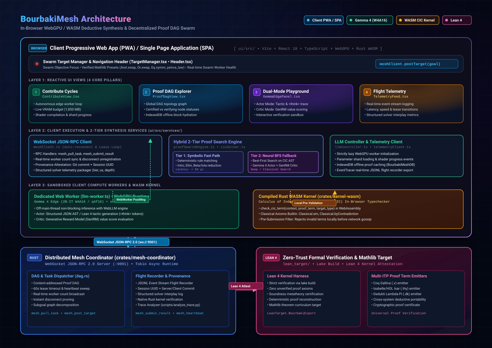

# BourbakiMesh: Game-Semantic Dialogue Proving & Distributed Proof Ledger

[](https://github.com/tryggth/bourbakimesh/actions)
[](https://www.rust-lang.org)
[](ui/)
[](crates/kernel-wasm)
[](lean_target/)
[](STATUS_REPORT.md)
[](#-licenses)

BourbakiMesh is a high-performance automated deduction and distributed theorem proving ecosystem. It unifies **game-semantic dialogue categories (Hyland-Ong / Lorenzen arenas)**, an in-browser **Gemma 4 WebGPU edge runtime (W4A16 / shader-f16)**, a high-speed **Calculus of Inductive Constructions (CIC) WASM kernel**, an asynchronous **Rust WebSocket JSON-RPC swarm coordinator**, and a **zero-trust formal verification bridge targeting Lean 4, Coq, Isabelle/HOL, and Dedukti**.

---

## 🏛️ System Architecture

<p align="center">
  <a href="docs/assets/architecture.svg" target="_blank" title="Click to open full-resolution vector SVG">
    
  </a>
  <br/>
  <em>🔍 <strong>Click diagram above to open the full-resolution vector SVG (<a href="docs/assets/architecture.svg"><code>docs/assets/architecture.svg</code></a>)</strong></em>
</p>

---

## 📦 Monorepo Subsystems

| Subsystem Path | Toolchain | Core Responsibility |
| :--- | :--- | :--- |
| **`ui/` (Client PWA / SPA)** | Vite + React 18 + TypeScript + WebGPU + Tailwind | Auto-updating Progressive Web App, **Gemma 4 W4A16 WebGPU edge worker**, 2-tier proof synthesis engine, in-browser **WASM CIC kernel typechecker**, real-time Proof DAG visualizer, and target objective manager. |
| **`crates/mesh-coordinator`** | Rust 1.80+ (2021/2024 ed., Tokio) | Async WebSocket JSON-RPC 2.0 coordinator (`:9001`), content-addressed Proof DAG (`dag.rs`), dynamic task lease scheduler, JSONL flight recorder telemetry, and Git commit/session provenance. |
| **`crates/kernel-wasm`** | Rust + `wasm-pack` (`wasm32-unknown-unknown`) | In-browser Calculus of Inductive Constructions (CIC) kernel (`check_cic_term`), classical axiom provider (`Classical.em`, `Classical.byContradiction`), and fast local validation gate. |
| **`crates/bourbaki-kernel`** | Rust 1.80+ (2021/2024 ed.) | Minimal Calculus of Inductive Constructions (CIC) AST, strategy extraction compiler $\mathcal{E}(\sigma)$, batch corpus decompiler (`decompile_corpus`), and universal multi-target emitters (**Lean 4, Coq, Isabelle/HOL, Dedukti**). |
| **`crates/bourbaki-ir`** | Rust 1.80+ (2021/2024 ed.) | Dialogue arena AST, Hyland-Ong / Lorenzen play traces, polarities ($P$ vs $O$), P-view/O-view calculation, arena cuts, and well-bracketing stack discipline. |
| **`crates/bourbaki-mesh`** | Rust 1.80+ (2021/2024 ed.) | Content-addressed cryptographic proof DAG (`ProofBlock`, `BlockId`), `ProofLedger`, Byzantine attestation engine, standalone `bourbaki-daemon` binary, libp2p GossipSub & Kademlia DHT swarm. |
| **`src/bourbakimesh`** | Python 3.11+ (Torch, FastAPI) | Neural dynamics models ($h_\theta, g_\theta, f_\theta$), polarity-inverting Latent MCTS, Prioritized Experience Replay (PER), champion tournament gating, and API telemetry bridge. |
| **`lean_target/`** | Lean 4 (`lake`, v4.33.0) | Zero-trust Lean 4 kernel verification harness, mechanized meta-theoretic soundness formalization (`LeanTarget.MetaTheory`), and Mathlib export tool (`export_mathlib`). |

---

## 🌐 Client PWA / SPA Architecture & 4 Core Pillars

BourbakiMesh features an auto-updating Progressive Web App (PWA) in `ui/` that serves as the primary volunteer computing node, visualizer, and deductive synthesis engine.

### The 4 Core UI Pillars:

1. **Pillar 1: "Contribute Cycles" Edge Worker ([`ui/src/components/ContributeView.tsx`](file:///home/tryggth2009/bourbakimesh/ui/src/components/ContributeView.tsx)):**
   - **Autonomous Edge Prover:** Continuously leases tasks from the coordinator, synthesizes candidate terms, runs local WASM kernel verification, and submits attested proofs.
   - **Gemma 4 Edge WebGPU Engine:** Runs compact quantized Gemma 4 (2B-IT W4A16 / q4f16) locally in-browser via WebGPU with `shader-f16` acceleration.
   - **Real-Time VRAM & Shard Progress:** Live progress indicators tracking parameter shard fetching, shader compilation, and GPU memory allocation (~1,850 MB).

2. **Pillar 2: Global Proof DAG Visualizer ([`ui/src/components/ProofDagView.tsx`](file:///home/tryggth2009/bourbakimesh/ui/src/components/ProofDagView.tsx)):**
   - **Topological DAG Graph:** Interactive canvas mapping verified theorem nodes, parent dependencies, and open subgoal frontiers.
   - **Offline Storage:** Automatically caches certified blocks to local IndexedDB (`BourbakiMeshDB`) for instant offline hydration.

3. **Pillar 3: Dual-Mode Actor-Critic Playground ([`ui/src/components/GemmaEdgePanel.tsx`](file:///home/tryggth2009/bourbakimesh/ui/src/components/GemmaEdgePanel.tsx)):**
   - **Actor Mode:** Generates formal tactics and structured AST sub-terms with deep `<think>` reasoning traces.
   - **Critic Mode:** Evaluates candidate steps using a Generative Reward Model (GenRM) producing value scores between $0.0$ and $1.0$.

4. **Pillar 4: Flight Telemetry Stream ([`ui/src/components/TelemetryFeed.tsx`](file:///home/tryggth2009/bourbakimesh/ui/src/components/TelemetryFeed.tsx)):**
   - **Live Coordinator Telemetry:** Displays connected edge worker counts, task throughput, lease lifecycles, and structured solver interplay telemetry (`tier1_symbolic` vs `tier2_neural_search`).

5. **Top-Level Objective Controller ([`ui/src/components/TargetManager.tsx`](file:///home/tryggth2009/bourbakimesh/ui/src/components/TargetManager.tsx)):**
   - Injects top-level swarm goals (`mesh_post_target`) directly over WebSocket JSON-RPC.
   - Includes verified Mathlib presets with zero unverified axioms (`And.swap`, `Or.swap`, `Eq.symm`, `peirce_law`).

---

## 🧠 Edge Model Runtime & Hybrid 2-Tier Solver Engine

| Component | Architecture & Spec | Memory / VRAM Footprint | Execution Target | Role |
| :--- | :--- | :---: | :---: | :--- |
| **Gemma 4 Edge** | 2B-IT W4A16 / q4f16 (WebLLM) | ~1,850 MB VRAM | WebGPU (`shader-f16`) | **Actor**: Tactic proposal & reasoning trace generation |
| **GenRM Critic** | Heuristic Value Head & Prior | In-model / Zero-extra | WebGPU / Worker | **Critic**: Value evaluation ($0.0 \dots 1.0$) for BFS priority ranking |
| **CIC WASM Kernel** | Rust `kernel-wasm` (Calculus of Inductive Constructions) | < 2 MB Memory | WebAssembly | **Validator**: In-browser pre-check (`check_cic_term`) |
| **Symbolic Matcher** | Intro/Elim/Reduction Engine | < 1 MB Memory | JavaScript / WebWorker | **Fast Path**: Resolves constructive logic subgoals in $<50\,\mu\text{s}$ |

### 2-Tier Proof Synthesis Architecture:
1. **Tier 1 (Symbolic Fast Path):**
   - Direct rule matcher applying constructive $\wedge$-intro, $\wedge$-elim, $\vee$-intro, $\to$-intro, and $\beta/\iota$-reduction.
   - Executes in $<50\,\mu\text{s}$ per subgoal with zero neural overhead.
2. **Tier 2 (Neural Best-First Search Fallback):**
   - Activated for complex, non-constructive, or classical propositions (e.g. `peirce_law`).
   - Decomposes target goals into an AST search frontier.
   - Queries the Gemma 4 Edge Actor for top-$k$ tactic actions and the GenRM Critic for priority score evaluation.
   - Verifies all candidate terms through the local WASM kernel before network submission.

---

## 🚀 Quickstart & Verification Matrix

### 1. Standard Verification Suite

```bash
# 1. Rust Workspace Check & Unit/Integration Tests (46 passing)
cargo check --workspace
cargo test --workspace

# 2. Python Test Suite & Type Verification (69 passing)
.venv/bin/pytest tests/

# 3. PWA Frontend Typecheck & Production Build
cd ui && npm run typecheck && npm run build && cd ..

# 4. Lean 4 Kernel Harness (13 jobs compiled)
cd lean_target && lake build && cd ..
```

### 2. Standalone Rust Mesh Coordinator

```bash
# Start the WebSocket JSON-RPC 2.0 coordinator server:
cargo run --bin mesh-coordinator
# Coordinator active at ws://127.0.0.1:9001
```

### 3. PWA Client Volunteer Node

```bash
# Launch the client PWA:
cd ui && npm install && npm run dev
# Open browser at http://localhost:5173
```

---

## 🛡️ Zero-Trust Verification & Multi-Target Emitters

BourbakiMesh enforces constructive soundness without trusting neural networks or heuristics:
1. **Dialogue Game Alternation:** Opponent ($O$) and Proponent ($P$) moves strictly alternate with valid justification pointers.
2. **Deterministic Extraction:** Winning strategies $\sigma$ are deterministically compiled to CIC terms via $\mathcal{E}(\sigma)$.
3. **Pluggable Multi-Target Verification:**
   - **Lean 4:** Kernel check via `lake env lean` with zero unverified axioms.
   - **Coq:** Emitted Gallina `.v` proof scripts.
   - **Isabelle/HOL:** Emitted Isar `.thy` proof scripts.
   - **Dedukti:** Emitted higher-order rewrite signatures (`.dk`).

---

## 📂 Monorepo Structure

```
bourbakimesh/
├── Cargo.toml                                 # Rust workspace configuration (2021/2024 ed.)
├── pyproject.toml                             # Python package specification & dependencies
├── CONTRIBUTING.md                            # Contributor guidelines & style guide
├── README.md                                  # System overview & quickstart
├── STATUS_REPORT.md                           # Verification & issue tracking matrix
├── .github/
│   └── workflows/deploy-pwa.yml               # GitHub Actions PWA automated deployment
├── docs/
│   ├── assets/                                # Vector SVG & high-resolution diagrams
│   │   ├── architecture.svg                   # Full-resolution scalable vector architecture diagram
│   │   └── architecture.png                   # High-res 2880px rendered architecture bitmap
│   └── wiki/                                  # Technical specifications & documentation
├── crates/
│   ├── kernel/                                # Core CIC AST, typechecker & multi-ITP emitters
│   ├── kernel-wasm/                           # In-browser WASM Calculus of Inductive Constructions kernel
│   ├── mesh-coordinator/                      # WebSocket JSON-RPC 2.0 swarm server & flight recorder
│   ├── bourbaki-ir/                           # Dialogue Arena AST, views & polarities
│   └── bourbaki-mesh/                         # Proof DAG, libp2p swarm & daemon primitives
├── src/bourbakimesh/                          # Python ML & Dynamics Engine
│   ├── api/                                   # FastAPI REST/WebSocket telemetry bridge
│   ├── corpus/                                # Mathlib curriculum ingestion pipeline
│   ├── training/                              # Dynamics training & champion gating
│   └── models.py                              # Neural dynamics models
├── ui/                                        # Vite + React 18 + TypeScript + WebGPU PWA
│   ├── src/components/                        # 4 Core Pillars: Contribute, DAG, Playground, Telemetry
│   ├── src/workers/llm-worker.ts              # Dedicated WebGPU Web Worker (Gemma 4 W4A16)
│   ├── src/wasm/kernel/                       # WASM CIC kernel bindings (check_cic_term)
│   ├── src/services/meshClient.ts             # WebSocket JSON-RPC 2.0 edge client
│   ├── src/services/proofSearchEngine.ts      # Hybrid 2-tier proof search engine
│   └── vite.config.ts                         # PWA & Workbox service worker configuration
├── tests/                                     # End-to-end Python integration tests
└── lean_target/                               # Zero-Trust Lean 4 verification harness (lake)
```

---

## 📜 Licenses

BourbakiMesh is dual-licensed under either:
- **[Apache License, Version 2.0](LICENSE-APACHE)** ([`LICENSE-APACHE`](LICENSE-APACHE))
- **[MIT License](LICENSE-MIT)** ([`LICENSE-MIT`](LICENSE-MIT))

See the top-level **[`LICENSE`](LICENSE)** file for details.
