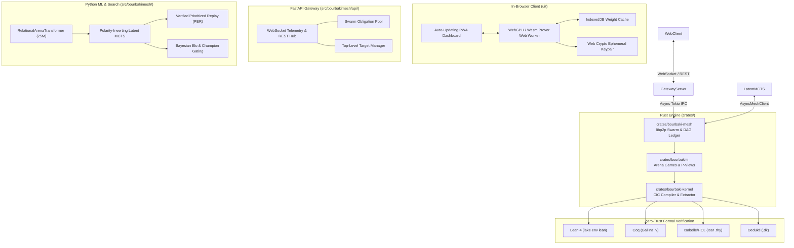

# Welcome to the BourbakiMesh Technical Wiki

**BourbakiMesh** is a polyglot automated theorem proving and formal deduction ecosystem designed for constructive mathematics. It bridges game-semantic dialogue games, deep reinforcement learning via Latent Monte Carlo Tree Search (MCTS), distributed peer-to-peer proving networks, in-browser WebGPU volunteer solvers, and zero-trust multi-target verification.

---

## 🏛️ Core Subsystem Architecture

---

## 📚 Technical Documentation Index

1. **[Volunteer Computing & Web Prover](Volunteer-Computing.md):**
   Architecture of browser Web Workers, WebGPU matrix acceleration, Web Crypto ECDSA P-256 node identity, and zero-trust verification.
2. **[Target Theorem Injection Protocol](Target-Injection-Protocol.md):**
   Mechanisms for researchers and automated agents to inject arbitrary Lean 4 propositions and dynamically focus swarm proving power.
3. **[P2P Model Distribution & Hot-Reloading](P2P-Model-Distribution.md):**
   Decentralized model chunk gossip over GossipSub `/bourbaki/1.0.0/models`, Merkle tree verification, and zero-downtime hot-swapping.
4. **[Multi-Target Compilers & Emitters](Multi-Target-Compilers.md):**
   Deterministic compilation of winning game strategies $\mathcal{E}(\sigma)$ to Calculus of Inductive Constructions (CIC) and multi-target code generation (Lean 4, Coq, Isabelle/HOL, Dedukti).
5. **[Model Registry & Benchmark Elo Ratings](https://github.com/tryggth/bourbakimesh#model-registry--baseline-tournaments):**
   Performance matrix and tournament rankings for `bourbaki_v0.pt`, `bourbaki_v1.pt`, and `bourbaki_v2.pt`.

---

## 🔬 Monorepo Map & Verification Harness

| Path | Language | Verification Target | Test Status |
| :--- | :--- | :--- | :---: |
| `crates/bourbaki-ir` | Rust 1.80+ | Arena AST, P-views, well-bracketing, `proptest` invariants | 🟢 17 / 17 passed |
| `crates/bourbaki-kernel` | Rust 1.80+ | CIC AST, extractor, multi-target emitters, decompiler | 🟢 31 / 31 passed |
| `crates/bourbaki-mesh` | Rust 1.80+ | Proof DAG, libp2p GossipSub/DHT, daemon, P2P hot-reload | 🟢 23 / 23 passed |
| `src/bourbakimesh` | Python 3.11+ | MuZero dynamics, Latent MCTS, PER, tournament, gateway | 🟢 69 / 69 passed |
| `ui/` | TypeScript / React | Auto-updating PWA, Web Worker, Web Crypto, IndexedDB | 🟢 Built Clean (18 assets) |
| `lean_target/` | Lean 4 | CIC Kernel harness, MetaTheory soundness mechanization | 🟢 12 / 12 jobs passed |

**Total Monorepo Tests:** **140 passed (71 Rust + 69 Python + 12 Lean 4 jobs)**
