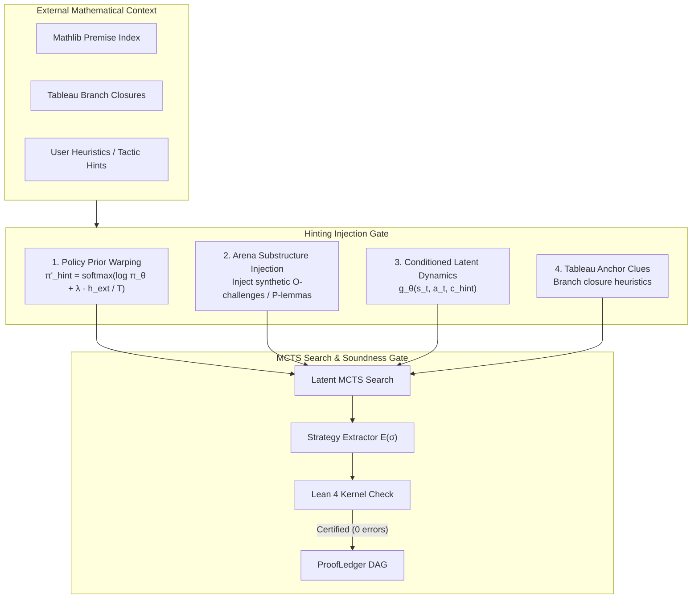

# RFC 0002: Neural and Game-Semantic Hinting Mechanisms for BourbakiMuZero

- **Feature Name:** `neural_game_semantic_hinting`
- **Start Date:** `2026-08-17`
- **Target PR / Issue:** `#20`
- **Author(s):** `@tryggth`
- **RFC PR:** `https://github.com/tryggth/bourbakimesh/pull/20`

---

## 1. Summary

This RFC specifies the mathematical formulation, algorithmic pipelines, and interface contracts for injecting external mathematical guidance into the `BourbakiMuZero` neural dynamics and `LatentMCTS` self-play engine without violating the zero-trust kernel verification invariant. 

We formalize four complementary hinting modalities:
1. **Policy Prior Warping** (online logit adjustment at root/internal nodes).
2. **Game Arena Substructure Injection** (synthetic Opponent challenges and Proponent lemma assertions in arena IR).
3. **Conditioned Recurrent Latent Dynamics** (context-conditioned state transitions $g_\theta(s_t, a_t, \mathbf{c}_{\text{hint}})$).
4. **Tableau / SMT Anchor Clues** (branch closure directions as heuristics for tree expansions).

---

## 2. Motivation & Game-Semantic Justification

In large mathematical theories (such as advanced algebra, topology, and analysis in Mathlib 4), the action branching factor in arena dialogue games grows substantially. While pure Latent MCTS self-play discovers short constructive strategies from cold-start seeds, scaling to multi-step lemma synthesis requires focusing search exploration on fruitful algebraic pathways.

### Invariant Preservation
- **Constructive Game Semantics:** Dialogue moves must continue to strictly respect Hyland-Ong view calculations, polarity alternation ($O \leftrightarrow P$), and well-bracketing stack discipline.
- **Zero-Trust Kernel Verification:** Hints act strictly as search guidance; every Proponent winning strategy $\sigma$ must compile to a valid Calculus of Inductive Constructions (CIC) proof term $\mathcal{E}(\sigma)$ and pass the reference Lean 4 kernel without admitting `sorry`, `axiom`, or unverified primitives.

---

## 3. Detailed Design: The 4 Hinting Modalities

### 3.1 Modality 1: Policy Prior Warping

Given the raw policy output $p_0 = \text{softmax}(z_0)$ from $f_\theta(s_0)$ and an external hint vector $\mathbf{h}_{\text{ext}} \in \mathbb{R}^{|\mathcal{A}|}$ (e.g., from premise selection or rule heuristics):

$$\pi'_{\text{hint}}(a \mid s_0) = \text{softmax}\left( \frac{\log p_0(a) + \lambda \cdot h_{\text{ext}}(a)}{T} \right)$$

where:
- $\lambda \in [0, 1]$ is the hint injection weight (decayed during self-play to prevent over-reliance).
- $T > 0$ is the exploration temperature.

### 3.2 Modality 2: Game Arena Substructure Injection

When an external engine (or user heuristic) suggests an intermediate lemma $L$, the arena engine injects a structured dialogue subgame into the active play trace $\tau$:
1. $P$ asserts lemma $L$: Move $m_{k} = (P, \text{Assert}, L, \text{pointer})$.
2. $O$ challenges lemma $L$: Move $m_{k+1} = (O, \text{Challenge}, L, k)$.
3. The search branches into proving $L$ and using $L$ to close the parent goal.

### 3.3 Modality 3: Conditioned Recurrent Latent Dynamics

The recurrent state transition network $g_\theta$ is augmented with a context embedding $\mathbf{c}_{\text{hint}} \in \mathbb{R}^{d_{\text{ctx}}}$:

$$(s_{t+1}, r_t) = g_\theta(s_t, a_t, \mathbf{c}_{\text{hint}})$$

where $\mathbf{c}_{\text{hint}} = \text{Pool}(\text{Transformer}(\text{Premises}))$. This enables the latent dynamics model to simulate transitions conditioned on available auxiliary lemmas.

### 3.4 Modality 4: Tableau & SMT Anchor Clues

First-order analytic tableau solvers identify branch closure sets $\{B_1, \dots, B_m\}$. These closure sets are projected into arena action space as bonus exploration terms in the PUCT formula:

$$Q'(s, a) = Q(s, a) + c_{\text{tableau}} \cdot \mathbb{I}[a \in \text{ClosureActions}]$$

---

## 4. Soundness & Security Considerations

1. **Tier 1 (Operational Runtime Kernel Gate):** Untrusted hints can never cause the acceptance of an unsound proof. If a hint leads MCTS down a false branch, the resulting strategy either fails to achieve Proponent victory or the extracted CIC term is rejected by `LeanEnvironment`.
2. **Tier 2 (Mechanized Meta-Theory):** The Soundness Theorem formalized in `LeanTarget.MetaTheory` operates on the extracted strategy tree $\sigma$. Because $\mathcal{E}(\sigma)$ is invariant to the heuristic search algorithm that found it, meta-theoretic guarantees are unconditionally preserved.
3. **Tier 3 (Empirical Testing):** Add adversarial test cases where intentionally poisoned or false hints (e.g. suggesting $\bot \to \text{True}$) are injected; assert that the falsification hunt rejects them and never commits invalid blocks.

---

## 5. Drawbacks & Performance Impact

- **Compute Overhead:** Computing external embeddings $\mathbf{h}_{\text{ext}}$ adds minor latency ($\approx 1\text{--}3\text{ ms}$) at root node initialization.
- **Search Bias:** Overly high $\lambda$ values may bias MCTS away from non-standard constructive proofs; $\lambda$ will be scheduled with an annealing schedule $\lambda_k = \lambda_0 \cdot \gamma^k$.

---

## 6. Prior Art & Alternatives

- **LeanDojo & ReProver:** Uses dense retrieval for premise selection in interactive tactics. BourbakiMesh differs by embedding hints into game-semantic arena dialogues and recurrent latent states rather than surface tactic strings.
- **Isabelle Sledgehammer & Thor:** Bridges interactive provers with external automated theorem provers (E, Vampire, Z3). BourbakiMesh integrates these via Modality 4 (Tableau/SMT anchor clues) directly into MCTS guidance.
- **AlphaZero / MuZero Guidance:** Online policy warping aligns with opening book injections in board games, adapted here for infinite-horizon mathematical dialogue arenas.

---

## 7. Roadmap & Implementation Plan

1. **Issue #19 (Phase 1):** Implement `PolicyWarping` transform in `src/bourbakimesh/latent_mcts.py`.
2. **Issue #20 (Phase 2):** Implement `SubgameInjection` in `crates/bourbaki-ir`.
3. **Issue #21 (Phase 3):** Implement context-conditioned dynamics $g_\theta(s, a, c)$ in `src/bourbakimesh/models.py`.
