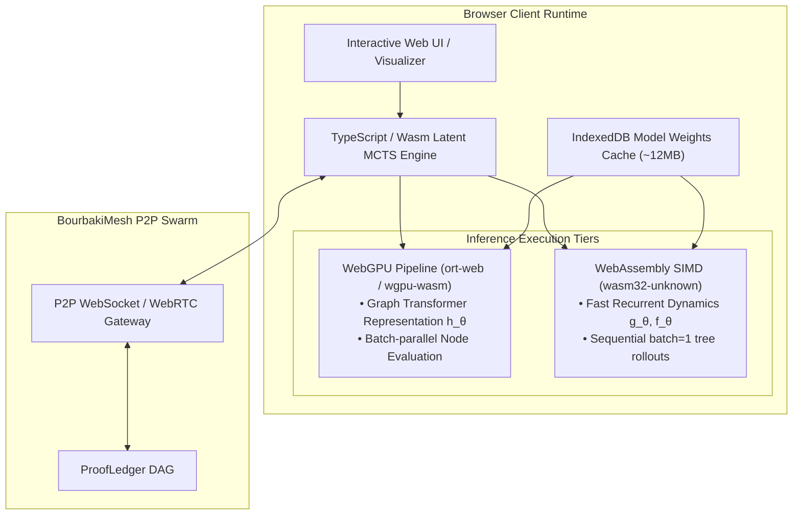

# RFC 0003: In-Browser WebGPU & WebAssembly Latent MCTS Inference Engine

- **Feature Name:** `webgpu_browser_inference`
- **Start Date:** `2026-08-17`
- **Target PR / Issue:** `feat(ml): R&D — In-Browser WebGPU & WebAssembly Latent MCTS Inference Engine`
- **Author(s):** `@tryggth`
- **Status:** Draft / Active R&D

---

## 1. Summary

This RFC specifies the architecture, memory model, and execution pipeline for running client-side `BourbakiMuZero` neural dynamics ($h_\theta, g_\theta, f_\theta$) and `LatentMCTS` tree search directly in modern web browsers using WebGPU, WebAssembly SIMD (`wasm-simd`), and ONNX Runtime Web (`ort-web`).

This capability unlocks two core monorepo goals:
1. **Zero-Install Interactive Visualizers (Epic #17):** Real-time proof search exploration, dialogue game stepping, and arena graph visualizers in standard browsers without server backend dependencies.
2. **Voluntary Distributed Browser Mesh Worker (Epic #16 / #21):** Heterogeneous volunteer compute nodes participating in the BourbakiMesh P2P proof swarm over WebSockets / WebRTC data channels.

---

## 2. Motivation & System Map

Currently, `bourbakimesh` runs in Python (PyTorch) for training/benchmarking and Rust for high-throughput node daemon operations. Enabling client-side browser execution requires addressing strict latency and memory constraints:

---

## 3. Technical Architecture & Hybrid Pipeline

### 3.1 Model Partitioning for Minimum Rollout Latency

In Latent MCTS, search consists of two distinct phases:
1. **Root Representation Step ($h_\theta$):**
   - Executed once per MCTS root move.
   - Computes relational attention over observation graph $s_0 = h_\theta(o_0)$.
   - Well-suited for **WebGPU compute shaders** with high tensor parallelism.
2. **Recurrent Tree Traversal ($g_\theta, f_\theta$):**
   - Executed 50–200 times sequentially during tree rollouts ($s_{t+1}, r_{t+1} = g_\theta(s_t, a_t)$ and $p_t, v_t = f_\theta(s_t)$).
   - Suffers from WebGPU CPU-GPU readback synchronization overhead when batch size is 1.
   - Optimized for **Wasm SIMD** with zero IPC readback penalty, keeping the search state in contiguous WebAssembly linear memory.

### 3.2 ONNX Export & Quantization

The PyTorch BourbakiMuZero model will be exported to ONNX computation subgraphs:
- `representation.onnx` ($h_\theta$)
- `dynamics.onnx` ($g_\theta$)
- `prediction.onnx` ($f_\theta$)

Optional INT8 / FP16 dynamic range quantization will reduce weight payload size from ~12.5 MB to ~3.2 MB, allowing rapid IndexedDB caching on initial page load.

---

## 4. Key Performance Targets

| Metric | Target (Desktop WebGPU / Wasm) | Target (Mobile Browser) |
| :--- | :---: | :---: |
| **Cold Model Load & Cache Time** | $< 1.5\text{ s}$ | $< 3.0\text{ s}$ |
| **Root Representation ($h_\theta$) Latency** | $< 15\text{ ms}$ | $< 40\text{ ms}$ |
| **Recurrent Step ($g_\theta + f_\theta$) Latency** | $< 0.8\text{ ms}$ (Wasm SIMD) | $< 2.5\text{ ms}$ |
| **MCTS Search Throughput (100 sims)** | $> 500\text{ sims/sec}$ | $> 150\text{ sims/sec}$ |
| **Memory Footprint (Wasm heap + VRAM)** | $< 120\text{ MB}$ | $< 80\text{ MB}$ |

---

## 5. Security & Verification Invariants

- **Constructive Verification:** Browser workers only generate candidate strategy traces $\sigma$. Winning strategies must still be submitted to and verified by a native node running the zero-trust Lean 4 / CIC kernel.
- **Sandboxed Execution:** Browser workers cannot write directly to the chain; proof blocks are signed with client-generated cryptographic keys and validated through standard Byzantine quorum thresholds.
